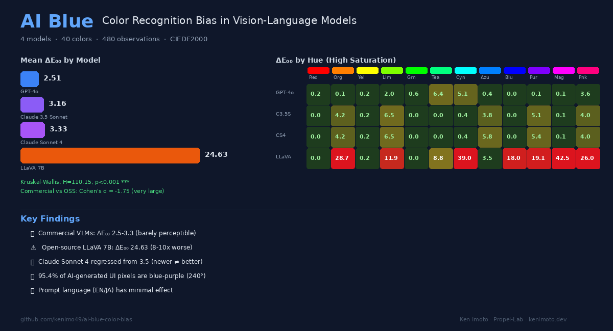

# AI Blue: Color Recognition Bias in Vision-Language Models

[](https://doi.org/10.5281/zenodo.19159702)



**VLMs can't see color accurately — and it's making every AI-generated UI look the same.**

We tested 4 models × 40 colors × 3 trials = 480 observations. Commercial VLMs miss intermediate hues. Open-source models are 10x worse. 95% of AI-generated UI colors land on blue-purple. This is why "AI Slop" looks the way it does.

📄 **[Read the Paper (PDF)](paper/main.pdf)** · 🌐 **[kenimoto.dev](https://kenimoto.dev)**

---

## Key Findings

- **Commercial VLMs (GPT-4o, Claude)** achieve ΔE₀₀ of 2.5–3.3 — barely perceptible, but systematically fail on intermediate hues (teal, lime, purple)
- **Open-source LLaVA 7B** shows 10x worse accuracy (ΔE₀₀ = 24.63, p < 0.001, Cohen's d = −1.75)
- **Claude Sonnet 4 regressed from 3.5** — newer model versions don't guarantee better color perception
- **95.4% of AI-generated UI pixels** fall in the blue-purple (240°) hue range
- **Prompt language doesn't matter** — English and Japanese prompts yield comparable accuracy

## Quick Results

| Model | Mean ΔE₀₀ | Median | Max | Parse Rate |
|-------|-----------|--------|-----|------------|
| GPT-4o | **2.51** | 1.96 | 12.24 | 100% |
| Claude 3.5 Sonnet | 3.16 | 2.95 | 16.36 | 100% |
| Claude Sonnet 4 | 3.33 | 3.14 | 16.36 | 100% |
| LLaVA 7B | 24.63 | 25.47 | 100.00 | 78% |

> **Statistical significance**: Kruskal–Wallis H = 110.15, p < 0.001. Commercial vs. OSS: Cohen's d = −1.75 (very large effect).

## Method

1. **40 solid-color stimuli** sampled from HSL color space (12 hues × 3 saturations + 4 achromatic)
2. **4 VLMs**: GPT-4o, Claude 3.5 Sonnet, Claude Sonnet 4, LLaVA 7B
3. **CIEDE2000** color difference (perceptually uniform, industry standard)
4. **3 supplementary experiments**: cross-lingual prompts, UI components (button/card/badge), AI-generated UI color distribution

## Repository Structure

```
├── README.md
├── hero.png                   # Overview figure
├── run_experiment.py          # Main experiment (480 observations)
├── run_english_prompt.py      # Cross-lingual prompt comparison (144 obs)
├── run_ui_component.py        # UI component experiment (108 obs)
├── images/                    # Solid-color stimulus images
│   └── ui_components/         # Button, card, badge test images
├── results/                   # Raw JSON results
│   ├── gpt-4o.json
│   ├── claude-3.5-sonnet.json
│   ├── claude-sonnet-4.json
│   ├── llava-7b.json
│   ├── english_prompt_comparison.json
│   ├── ui_component_results.json
│   ├── statistics.json
│   └── color_distribution_analysis.json
├── paper/
│   ├── main.tex               # LaTeX source
│   ├── main.pdf               # Compiled paper (9 pages)
│   └── figures/               # Paper figures
└── LICENSE                    # MIT
```

## Reproducing

### Requirements

```bash
pip install Pillow requests
```

### Run Experiments

```bash
# Set API keys
export OPENAI_API_KEY="your-key"
export ANTHROPIC_API_KEY="your-key"

# Main experiment (40 colors × 4 models × 3 trials)
python run_experiment.py

# English vs Japanese prompt comparison
python run_english_prompt.py

# UI component context experiment
python run_ui_component.py
```

### Compile Paper

```bash
cd paper
pdflatex main.tex && pdflatex main.tex
```

## Citation

```bibtex
@article{imoto2026aiblue,
  title   = {AI Blue: Systematic Color Recognition Bias in Vision-Language
             Models and Its Implications for AI-Generated UI Design},
  author  = {Imoto, Ken},
  year    = {2026},
  url     = {https://github.com/kenimo49/ai-blue-color-bias},
  doi     = {10.5281/zenodo.19159702},
  url     = {https://zenodo.org/records/19159702},
  note    = {Preprint, Zenodo}
}
```

## License

MIT — use freely, cite if you publish.

---

If this project saved you time, you can [sponsor its continued maintenance](https://github.com/sponsors/kenimo49).
